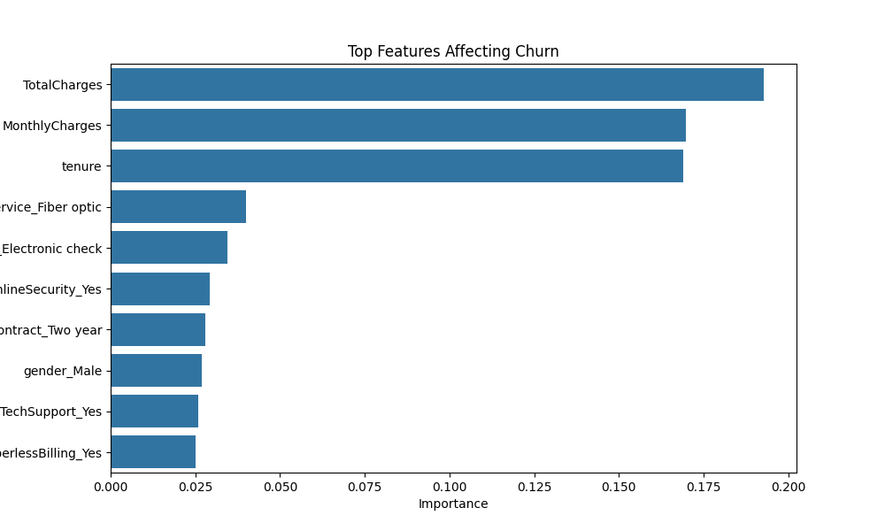

# 📊 Customer Churn Prediction using Machine Learning

> A Data Science project focused on predicting customer churn and understanding the key factors that influence customer retention.

---

## 📌 Objective

To predict which customers are likely to churn and identify the main drivers behind customer attrition.

---

## 🎯 Motivation

This project was built as part of my preparation for Data Science master's programs.
While working on this, I wanted to understand how machine learning can be applied to real business problems like customer retention and why customers leave.

---

## 📂 Dataset

* Telco Customer Churn Dataset
* Includes customer demographics, services used, charges, and churn status

---

## 🛠 Tools & Technologies

* Python (pandas, numpy, matplotlib, seaborn)
* scikit-learn (Random Forest, evaluation metrics)

---

## 📈 Methodology

1. Data cleaning and preprocessing
2. Handling missing values (`TotalCharges`)
3. Encoding categorical variables
4. Train-test split
5. Model training using Random Forest
6. Model evaluation:
   * Accuracy
   * Confusion Matrix
   * Classification Report
7. Feature importance analysis

---

## 📊 Results



**Model Performance:**

* Accuracy: 0.79
* The model performs reasonably well for a baseline and captures general churn patterns, though it struggles with some edge cases.

---

## 🧠 Key Insights

* Customers with higher monthly charges are more likely to churn
* Customers with shorter tenure are at higher risk
* Fiber optic users show higher churn behavior (possibly due to higher pricing)
* Lack of additional services (security/support) increases churn

---

## ⚠️ Limitations

* Model may not capture all behavioral patterns
* Random Forest is used as a baseline; performance can be improved with tuning or advanced models
* Does not include time-based behavior or customer interaction history

---

## 💡 Business Recommendations

* Offer incentives or retention plans for high-paying customers
* Focus on onboarding and retention in early customer lifecycle
* Improve customer support services
* Re-evaluate pricing strategy for high-risk segments

---

## 📁 Project Structure

```
churn-prediction-project/
│
├── data/
├── notebook/
├── output/
└── README.md
```

---

## ▶️ How to Run

1. Clone the repository
2. Install dependencies:

```
pip install pandas numpy matplotlib seaborn scikit-learn
```

3. Open notebook:

```
jupyter notebook
```

4. Run all cells

---
